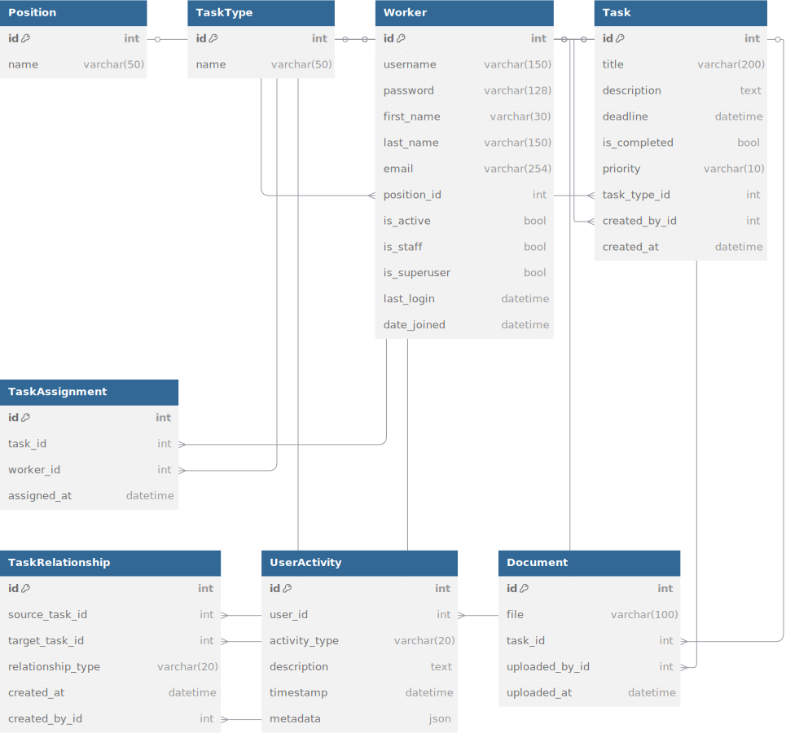

**Task Manager for IT Teams**
**Django-based task management system for developers, designers, PMs, and QA specialists**


  
  
  

**📌 About the Project**

This task manager is designed for IT teams that need a simple yet powerful system to organize workflows. It allows users to:
✅ Create and assign tasks to team members (developers, designers, PMs, QAs).
✅ Track status (done/pending) and deadlines.
✅ Categorize tasks using tags (e.g., bug, refactoring, design).
✅ Work within projects and teams.

--- 

**⚙️ Technologies**

Backend: Django (MVT, ORM, Authentication)
Frontend: Bootstrap 5, Crispy Forms
Database: SQLite (scalable to PostgreSQL)
Additional features: Pagination, Search, User Roles, Session Management

--- 

**🔧 Features**

Authentication: Registration, login/logout (django.contrib.auth).
Task CRUD: Add, edit, delete, and mark tasks as completed.
Filtering: Search by title, tags, or status.
Pagination: Split task lists into pages.
User profiles: View assigned/completed tasks.

--- 

**📂 Database Structure**  


--- 

**🚀 How to Deploy?**

1. **Clone the repository**:
   ```bash
   git clone https://github.com/your-username/task-manager.git
   cd task-manager
   ```

2. **Install dependencies**:
   ```bash
   pip install -r requirements.txt
   ```

3. **Set up the database**:
   ```bash
   python manage.py migrate
   ```

4. **Load initial data** (recommended for first launch):
   ```bash
   python manage.py loaddata initial_data.json
   ```

5. **Test superuser credentials** (available after loading fixture):
   ```
   Login: admin111
   Password: q1w2e3r4
   ```

6. **Run the development server**:
   ```bash
   python manage.py runserver
   ```

--- 

**💡 Why Is This Project Worth Attention?**

Ready to use: Easy to deploy, intuitive interface.
Flexible: Can be extended (API, notifications, etc.).
Portfolio-worthy: Demonstrates Django, Bootstrap, and ORM skills.

--- 

**👉 PRs and ideas are welcome!**
